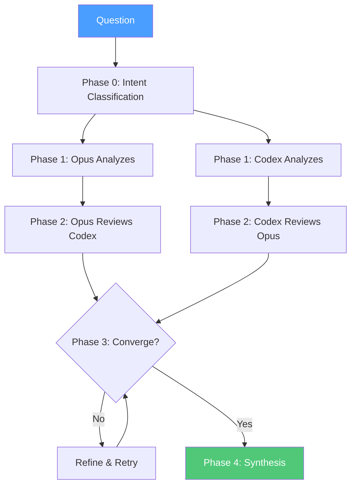
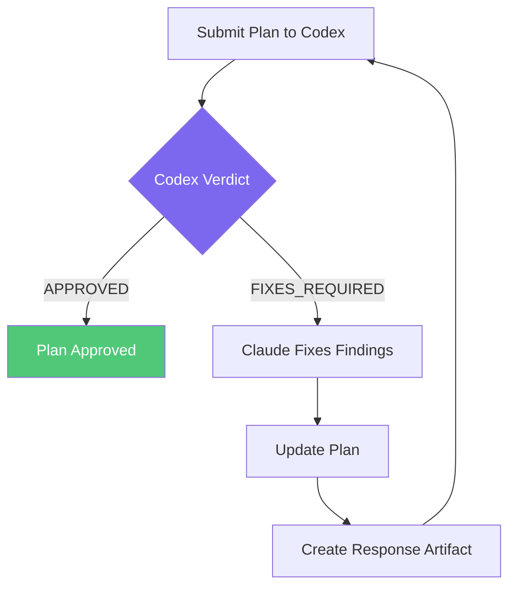
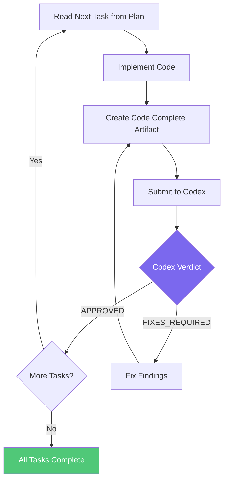

# Maistro User Guide

Maistro is a portable orchestration system that turns Claude into an autonomous
developer. You give Claude a short prompt, and it drives the entire workflow —
researching, planning, coding, and getting each artifact reviewed by a second
LLM (Codex). Your role is to provide direction and intervene only when needed.

---

## The Pipeline

Every non-trivial change follows this pipeline. Each step produces artifacts
that feed the next. **Restart Claude between steps** to keep context clean.

> **Not every step is required.** Skip Research if you already know the solution.
> Skip straight to Code Review if the plan is already approved. Use your judgement.

---

## Step 1: Research (Optional)

**When to use:** You have a bug, feature idea, or technical question and want
two LLMs to independently analyze it before you commit to an approach.

**What it produces:** A `research/<slug>/synthesis.md` with Agreement,
Disagreement, Synthesis, and Recommendations sections.

**Prompt to give Claude:**

> Read `how_to/guides/orchestrator.md` and research this question:
> "Why is the streaming endpoint dropping connections after 30 seconds?"

Claude will:
1. Classify the question intent (debugging, investigation, etc.)
2. Run both Opus and Codex independently
3. Have them cross-review each other
4. Iterate until they converge (or hit max rounds)
5. Produce a synthesis document

**Exit condition:** `synthesis.md` exists. Restart Claude.

**Detailed guide:** [research.md](research.md)

---

## Step 2: Draft the Plan

**When to use:** You know what to build (from research or your own analysis)
and need a structured plan before implementation.

**Prompt to give Claude:**

> Read the plan template at `how_to/templates/master_plan_template.md` and
> create a plan for [describe what you want] based on the research at
> `research/<slug>/synthesis.md`. Save it to
> `active_plans/<slug>/<slug>_master_plan.md`.

For simpler features (1-5 tasks, no phases):

> Read the plan template at `how_to/templates/simple_plan_template.md` and
> create a plan for [describe what you want]. Save it to
> `active_plans/<slug>.md`.

**Choosing simple vs complex:**

| Simple Plan | Complex Plan (Master + Phases) |
|-------------|-------------------------------|
| 1-5 tasks | 6+ tasks across multiple phases |
| Single file | Master plan + phase files |
| Small features, bug fixes | Multi-phase projects |

Claude will discuss requirements with you, ask clarifying questions, and
produce a draft plan following the template structure exactly.

**Exit condition:** Draft plan file exists in `active_plans/`. Restart Claude.

---

## Step 3: Plan Review Loop

**When to use:** You have a draft plan that needs formal review before
implementation begins.

**Prompt to give Claude:**

> Read `how_to/guides/orchestrator.md` and review this plan:
> `active_plans/<slug>/<slug>_master_plan.md`

Claude will:
1. Send the plan to Codex for review
2. Read the structured verdict (APPROVED or FIXES_REQUIRED)
3. If fixes needed: address every finding, update the plan, resubmit
4. Repeat until Codex approves with zero findings

**What "approved" means:** The Codex reviewer returned `VERDICT: APPROVED`
with all severity counts (blocker, major, minor, decisions) at zero.

**Exit condition:** Plan approved. Restart Claude.

**Detailed guide:** [plan_review.md](plan_review.md)

---

## Step 4: Code Review Loop

**When to use:** You have an approved plan and need Claude to implement it
task by task.

**Prompt to give Claude:**

> Read `how_to/guides/orchestrator.md` and implement this plan:
> `active_plans/<slug>/<slug>_master_plan.md`

Claude will:
1. Read phase 0, task 1 from the plan
2. Write the code
3. Create a code_complete artifact
4. Submit to Codex for review
5. Fix any findings and resubmit until approved
6. Move to the next task automatically
7. Continue through all tasks in all phases

**Exit condition:** All tasks across all phases approved. Restart Claude.

**Detailed guide:** [code_review.md](code_review.md)

---

## Context Hygiene

**Always restart Claude between steps.** This is not optional.

| Why | What Happens If You Don't |
|-----|--------------------------|
| **Clean context** | Long sessions accumulate confusion and hallucinations |
| **Artifact contracts** | Each step reads files, not conversation history |
| **Prevents drift** | Claude forgets earlier corrections in long sessions |
| **Auditability** | Each step produces explicit artifacts you can inspect |

The artifacts on disk are the handoff mechanism. The research synthesis feeds
the plan draft. The approved plan feeds the code implementation. No context
needs to carry over in the conversation.

---

## Quick Reference

| Step | Prompt | Artifact Produced | Detailed Guide |
|------|--------|-------------------|----------------|
| 1. Research | `Read how_to/guides/orchestrator.md and research: "..."` | `research/<slug>/synthesis.md` | [research.md](research.md) |
| 2. Draft Plan | `Read how_to/templates/master_plan_template.md and create a plan for ...` | `active_plans/<slug>/` | — |
| 3. Plan Review | `Read how_to/guides/orchestrator.md and review this plan: active_plans/...` | Approved plan | [plan_review.md](plan_review.md) |
| 4. Code Review | `Read how_to/guides/orchestrator.md and implement this plan: active_plans/...` | Working code | [code_review.md](code_review.md) |

---

## Roles

| Role | Who | What They Do |
|------|-----|--------------|
| **You** (human) | Developer | Give prompts, review results, intervene if stuck |
| **Claude** | Orchestrator + Coder/Planner | Drives everything — reads, writes, runs CLI, iterates |
| **Codex** | Reviewer | Reviews Claude's work via subprocess (never called directly) |

You never run the orchestrator CLI yourself. You never call Codex directly.
You give Claude a prompt and it handles the rest.

---

## Setup

See [setup.md](setup.md) for environment prerequisites (Claude Code CLI,
Codex CLI, Python 3.10+).

## Technical Reference

See [reference.md](reference.md) for the ORCH_META protocol, finding ID
conventions, artifact naming, and full CLI option reference.
